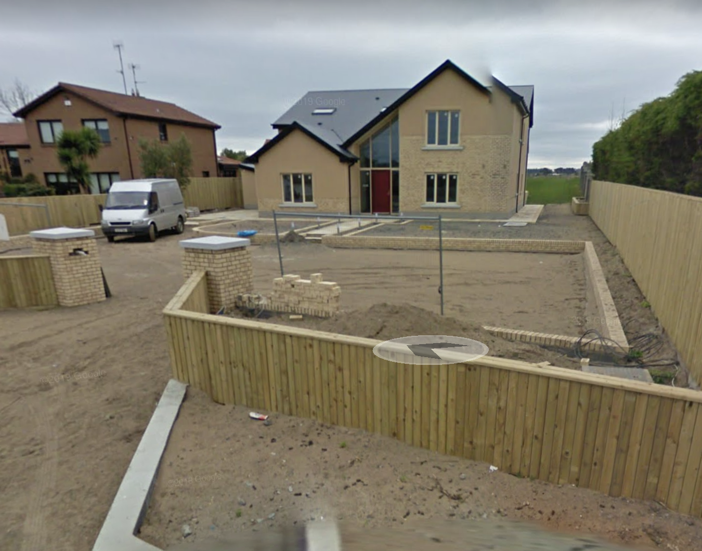

# Brief
[Home](/house/)  
[Front of House](front.md)  
[Back of House](back.md)  
[Driveway](driveway.md)  
[Back Garden](garden.md)  
[Kitchen](kitchen.md)  
[Office](office.md)  
[Utility](utility.md)  

# Front of house 

## Notes
- We love the idea of a tall window
- Some sort of stone feature 

## Example 1

### What we like:
- Glass window above hall door + overhang

## Example 2

### What we like:
- 2 triangles
- long window on right hand side triangle

## Example 3

### What we like:
- Stonework feature 
- long window

## Example 4

### What we like:
- Stonework feature 
- Shape of doorframe
- glass panels around the door
- we love this style of hall door but not sure if it will fit in with the overall style of house (do these doors only work with older style houses?) 

## Example 5

### What we like:
- Glass panels around the door
- Stone feature
- long window at front
