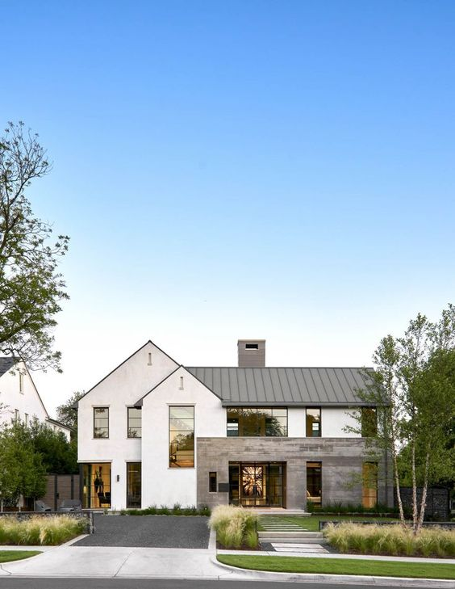
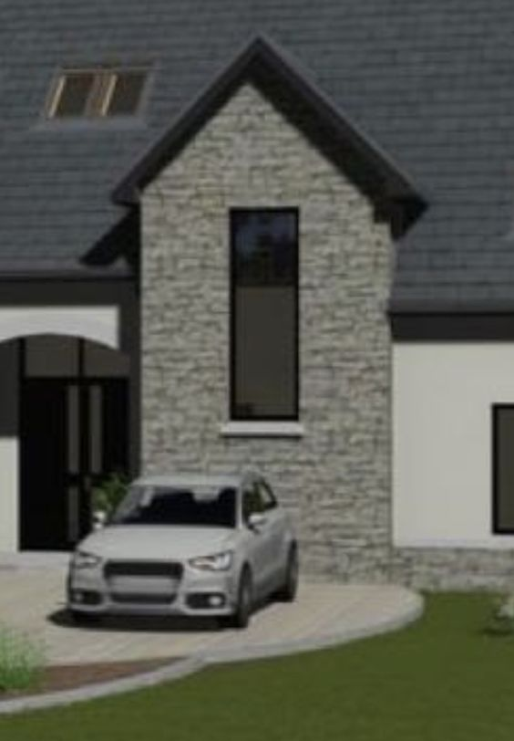
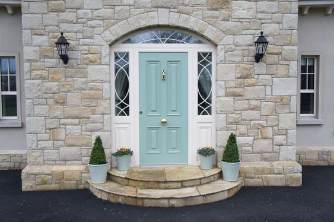
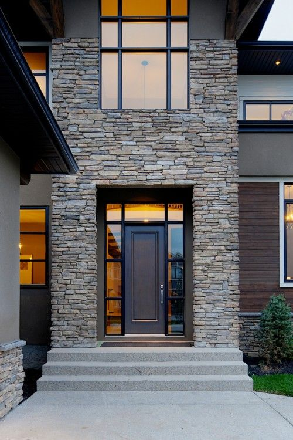

# Brief
[Home](brief.md)  
[Front of House](front.md)  
[Back of House](back.md)  
[Driveway](driveway.md)  
[Back Garden](garden)  

# Front of house 

## Example 1

### Likes
- 2 triangles
- long window on right hand side triangle

## Example 2

### Likes
- Stonework feature 
- long window

## Example 3

### Likes
- Shape of doorframe
- glass panels around the door

## Example 4

### Likes
- Glass panels around the door
- Stone feature
- long window at front

