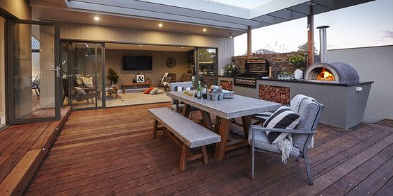
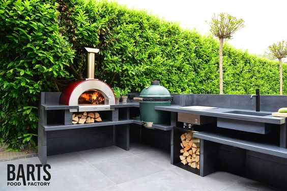
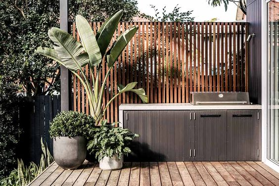

# Brief
[Home](brief.md)  
[Front of House](front.md)  
[Back of House](back.md)  
[Driveway](driveway.md)  
[Back Garden](garden.md)  
[Kitchen](kitchen.md)  
[Office](office.md)  
[Utility](utility.md)  

# Back Garden

## Notes
We spend a lot of time cooking outdoors on our BBQ (all year round) so having a BBQ area easily accessible from the house is important for us. Having it sheltered from the rain would be a bonus, but not essential. 

We go kayaking most weekends during the summer so having enough space to comfortably transport the kayaks + gear down the side of the house ot store out the back is important. 

## Example 1

### Likes
- BBQ / Patio area
- Indoor space leading out to outdoor seating 

## Example 2

### Likes
- BBQ area

## Example 3

### Likes
- BBQ area built into patio, close to the house
